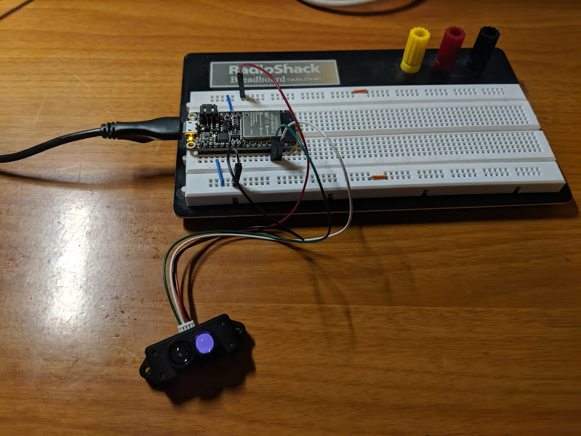

#  MicroLIDAR

Authors: Isabella Kuhl, Laura Reeve, Joseph Rossi, 2019-10-29

## Summary

For this skill we build a small module that reads the TFMini LIDAR sensor over
UART. The code reads 256 bytes at a time, and averages the distances and strengths
from all of the 9-byte frames within the 180 byte window (20 frames).

The datasheet lists a test frequency indicating the maximum sample rate of this sensor
is about 100Hz.

## Sketches and Photos

    

## Modules, Tools, Source Used in Solution
* [UART](https://docs.espressif.com/projects/esp-idf/en/stable/api-reference/peripherals/uart.html)
* [MicroLIDAR Datasheet](https://cdn.sparkfun.com/assets/5/e/4/7/b/benewake-tfmini-datasheet.pdf)

## Supporting Artifacts

* [Demo Video](https://youtu.be/UOiVhweZCAo)

-----

## Reminders
- Repo is private
