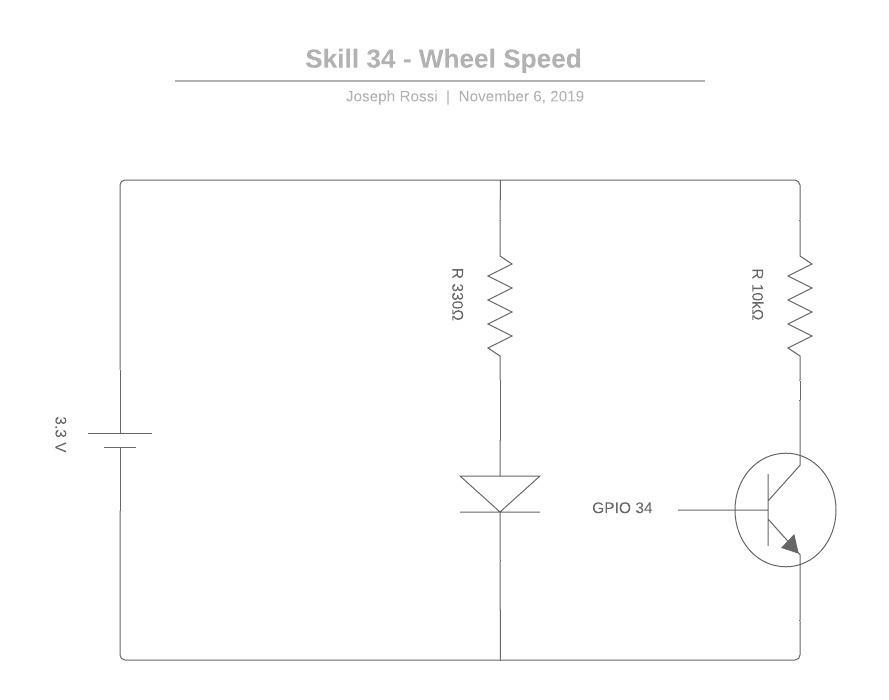

#  Wheel Speed

Author: Joseph Rossi, Isabella Kuhl, Laura Reeve 2019-11-06

## Summary

For this skill we attached the encoder template to the rear wheel and mounted the 
QD1114 optical sensor pointed at the template. When the wheels turn, the optical
sensor counts the number of pulses that pass by. Each white/black pair is counted as one 
pulse, so every six pulses is a single revolution of the wheel. From there we can 
calculate the speed the crawler would be traveling as follows:

```
    Diameter (D)= 0.1778 m
    Speed (m/s) = (3.14159 * D * Revolutions)/dt
```

This speed shown to the alphanumeric display. 

The pulse counter configuration was determined empirically by creating a GPIO mode 
and observing the different analog voltages when the optical sensor was reading a
black or white tile..


## Sketches and Photos

<center></center>

* [Demo Video](https://youtu.be/qhAuJcrR_gQ)


## Modules, Tools, Source Used in Solution

* [Pulse Counter](https://docs.espressif.com/projects/esp-idf/en/stable/api-reference/peripherals/pcnt.html)
* [QRD1114](https://learn.sparkfun.com/tutorials/qrd1114-optical-detector-hookup-guide#example-circuit)
* Alphanumeric Display
* Skill 29 - Crawler

-----

## Reminders
- Repo is private
