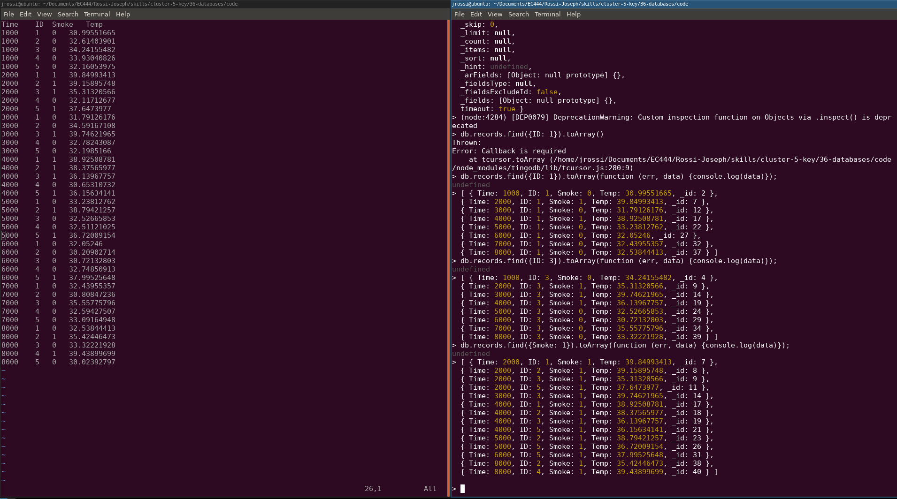
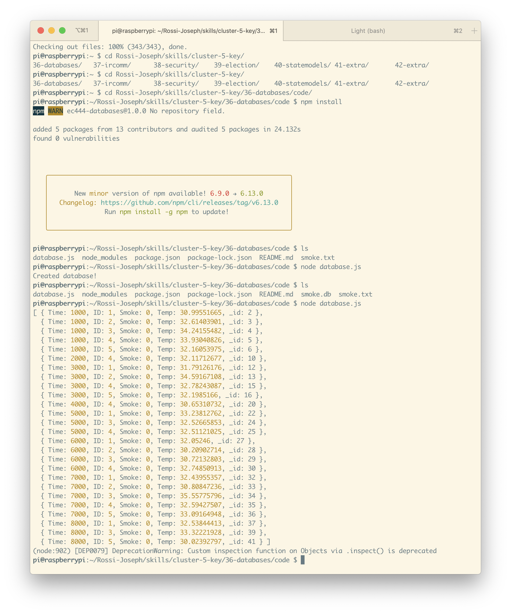

#  Databases

Author: Isabella Kuhl, 2019-11-12

## Summary

For this skill I created a simple script to populate and query a Tingodb
database. When run from the console, the `database.js` script will parse
the file `smoke.txt` and populate the database.  Once the database exists
the module can be imported and used to query the records.

## Sketches and Photos

    Screenshot of Database Queries
    

    On the Raspberry Pi
    

## Modules, Tools, Source Used in Solution

* NodeJS
* TingoDB
* Smoke.txt

-----

## Reminders
- Repo is private
