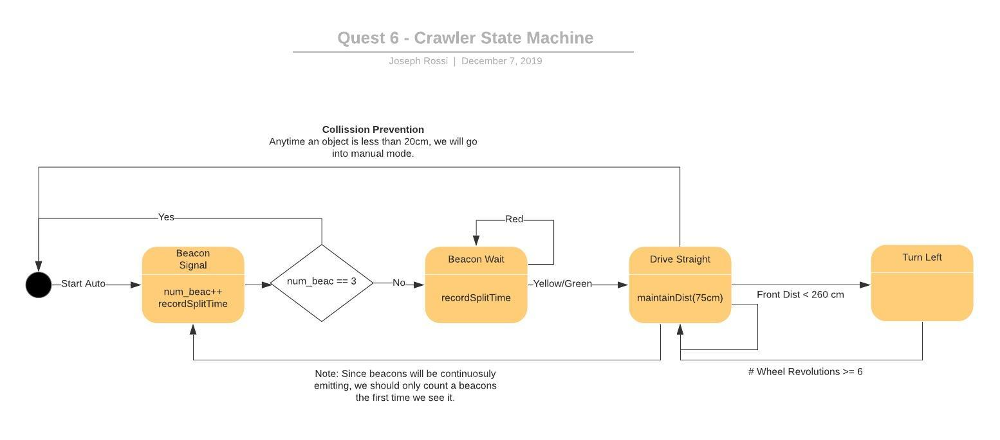

#  Rollup Navigation

Author: Joseph Rossi, Laura Reeve, Isabella Kuhl, 2019-12-07

## Summary
We modeled the racecourse as a state machine, to operate the crawler in autonomous driving mode.
This effectively turned our state machine from quest 4 into an HSM, where one of the sub-state
machines is automatically driving the course.

When put in autonomous driving mode, the autonomous FSM starts in Beacon state. Below is a description of the
diagram above, specifically what actions are taken in each state and the conditions that trigger
a transition out of each state:

1. Beacon: Record the split time.
    1. If this is the third beacon, stop. We're done with the course, change the top level state
       to CRAWL_STATE_STOPPED. From there, we will be able to manually control the crawler.
    2. Otherwise, wait for a non-red light then change to Drive Straight.
2. Drive Straight: Keep a constant distance from the wall on the right and regulate the speed of the crawler using PID.
    1. If we detect a wall is less than 260cm  ahead of us (this number will probably change during debugging), then change to Turn Left.
3. Turn Left: Steer the crawler hard left, count the number of times the rear wheel completes a revolution (using the pulse counter).
    1. After the rear wheel completes 6 revolutions, change to Drive Straight.

The autonomous FSM will also include logic to monitor for new beacons. The receiver task will enqueue messages as they are received.
The autonomous driving logic will read from the queue and respond to new beacons as they are detected.

In addition to the autonomous FSM, the crawler firmware will be performing the following tasks:
* It will constantly monitor the collision sensor in the front of the crawler for hazards. If a hazard is detected,
the crawler will stop and exit autonomous driving mode.
* It will periodically read new values from the sensors in a separate task so as not to block any other logic.
* It will be listening to commands sent via a UDP socket.

-----

## Reminders
- Repo is private
